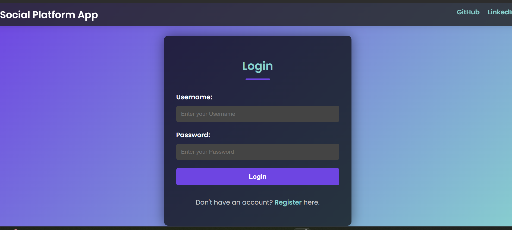
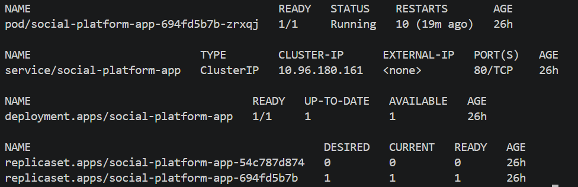
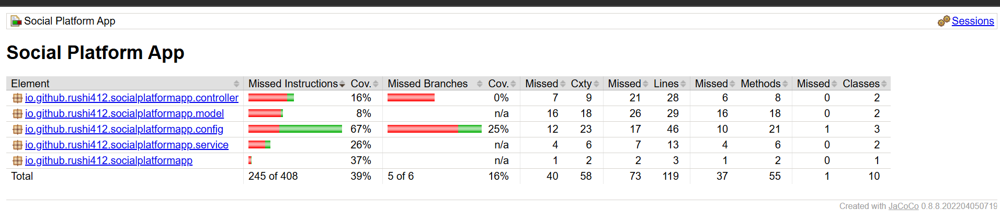

# Social Platform App

A learning and portfolio project that demonstrates a Spring Boot social-posting application with a containerized delivery workflow and no-cost local Kubernetes deployment through kind.

## Maintainer

- **Rushikesh Deshmukh**
- GitHub: [Rushi412](https://github.com/Rushi412)
- LinkedIn: [Rushikesh Deshmukh](https://www.linkedin.com/in/rushikesh-d-150b271a9/)
- Email: [rushipdeshmukh412@gmail.com](mailto:rushipdeshmukh412@gmail.com)

## Stack

- Java 17 and Spring Boot 3
- Spring Security, Thymeleaf, JPA, H2 for local development
- Maven and JaCoCo
- Docker, Kubernetes, Jenkins, Trivy
- kind with the Docker Desktop engine for local deployment
- Terraform and AWS EKS as an optional infrastructure study reference only

## Architecture

See [architecture documentation](docs/architecture.md).

## Demo workflow

1. Run Maven tests and generate the application JAR.
2. Build a multi-stage Docker image.
3. Scan source code and the image using Trivy.
4. Deploy the image to the local kind Kubernetes cluster.
5. Kubernetes runs the application in the `social-app` namespace.
6. Access the application through port forwarding and verify `/actuator/health`.

## Evidence

| Area | Command |
|---|---|
| Tests | `.\mvnw.cmd clean test` |
| Docker build | `docker build -t social-platform-app:local -f deploy/docker/Dockerfile .` |
| Kubernetes status | `kubectl get all -n social-app` |
| Health check | `Invoke-WebRequest http://localhost:8080/actuator/health` |

## Repository layout

```text
ci/                       Jenkins pipeline
deploy/docker/            Container build
deploy/kubernetes/base/   Kubernetes namespace, deployment, service, and config
docs/                     Architecture and operating notes
infrastructure/terraform/ Optional EKS learning infrastructure
src/                      Spring Boot application
```

### Local application



### Kubernetes deployment



### Test coverage



## Run locally

Install Java 17+. The checked-in Maven Wrapper downloads Maven automatically on first use:

```powershell
.\mvnw.cmd clean test
.\mvnw.cmd spring-boot:run
```

The application runs at `http://localhost:8080`. The H2 console is enabled only in the default local profile.

## Docker

```powershell
docker build -t social-platform-app:local -f deploy/docker/Dockerfile .
docker run --rm -p 8080:8080 social-platform-app:local
```

Push production images with immutable tags, for example `rushi412/social-platform-app:42`; do not rely on `latest`.

## Kubernetes

The application uses namespace `social-app` and a standalone kind cluster as its no-cost learning target. Follow the [local Kubernetes guide](deploy/kubernetes/local/README.md) to create the cluster and deploy the application.

Validate the manifests before any deployment:

```powershell
kubectl apply --dry-run=client -f deploy/kubernetes/base
```

The local manifests use H2 and require no database setup. For a future production deployment, copy `deploy/kubernetes/examples/secret.example.yaml` to `secret.yaml`, replace the database placeholders, set the active profile to `prod`, and apply the secret separately. The real secret file is ignored by Git.

The Jenkins pipeline deploys an image tagged with the Jenkins build number and waits for a rollout to complete. Configure the `dockerhub-credentials` and `social-app-kubeconfig` credential IDs in Jenkins before running it.

## Optional infrastructure study reference

Terraform defaults to `ap-south-1`, selected for geographic proximity. AWS has no free EKS region: the EKS control plane, worker nodes, networking, and storage may be charged. This repository's supported learning path is standalone kind; do not run Terraform unless you intentionally want a billable AWS exercise.

```powershell
Set-Location infrastructure/terraform
terraform fmt -recursive
terraform init
terraform validate
terraform plan
```

Run `terraform destroy` when a temporary learning environment is no longer needed.

## Security notes

- Never commit `.env`, credentials, kubeconfigs, Terraform state, or Docker tokens.
- Development and production database configuration is provided through `DB_URL`, `DB_USERNAME`, and `DB_PASSWORD`.
- H2 Console is local only; it is disabled in `dev` and `prod` profiles.

## Credits

This repository started as a learning exercise created by Rushikesh Deshmukh as a portfolio project. Verify the original project's license and retain any required attribution before distributing this work.


[def]: docs/images/test-coverage.png