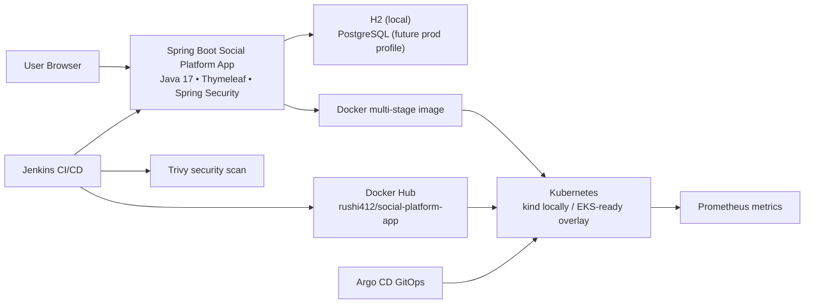

```mermaid
flowchart LR
    User["User Browser"]
    App["Spring Boot Social Platform App<br/>Java 17 • Thymeleaf • Spring Security"]
    DB["H2 (local)<br/>PostgreSQL (future prod profile)"]
    Docker["Docker multi-stage image"]
    Kubernetes["Kubernetes<br/>kind locally / EKS-ready overlay"]
    Jenkins["Jenkins CI/CD"]
    Trivy["Trivy security scan"]
    DockerHub["Docker Hub<br/>rushi412/social-platform-app"]

    User --> App
    App --> DB
    App --> Docker
    Docker --> Kubernetes
    Jenkins --> App
    Jenkins --> Trivy
    Jenkins --> DockerHub
    DockerHub --> Kubernetes
    Argo["Argo CD GitOps"] --> Kubernetes
    Kubernetes --> Prometheus["Prometheus metrics"]
```
